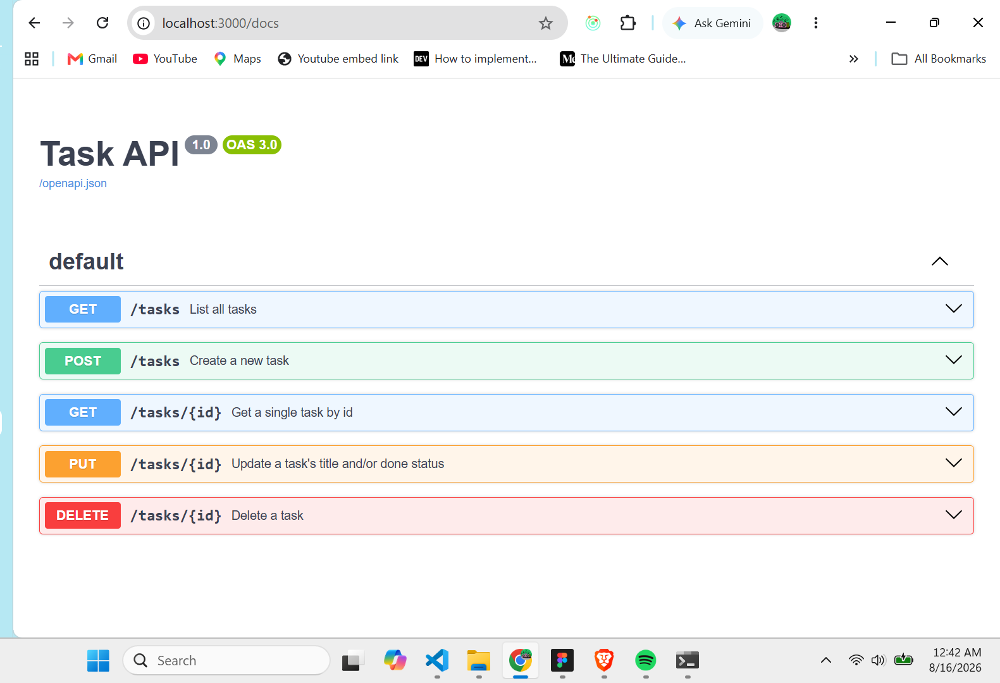

To install dependencies:

```sh
bun install
```

To run:

```sh
bun run dev
```

open http://localhost:3000

# Task API

A simple REST API for managing tasks, built with Hono and Bun.

## Stack

- Runtime: Bun
- Framework: Hono
- Docs: Swagger UI (`@hono/swagger-ui`)
- Storage: in-memory array (no database yet)

## Running locally

\`\`\`bash
bun install
bun run index.ts
\`\`\`

Server runs at `http://localhost:3000`.

## Endpoints

| Method | Path         | Description                              |
| ------ | ------------ | ---------------------------------------- |
| GET    | `/`          | API info                                 |
| GET    | `/health`    | Health check                             |
| GET    | `/tasks`     | List all tasks                           |
| GET    | `/tasks/:id` | Get a single task                        |
| POST   | `/tasks`     | Create a task                            |
| PUT    | `/tasks/:id` | Update a task's title and/or done status |
| DELETE | `/tasks/:id` | Delete a task                            |

## API Docs

Interactive Swagger UI is available at `/docs`.



## Notes

- Data is stored in memory and resets when the server restarts. Persistence (a real database) is a planned next step.
